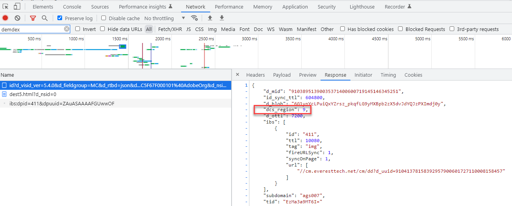

# Experience Platformの場所のヒント、AAM DCS の地域ノード、ID サービスの場所のヒント

## 説明 {#description}

AEP WebSDK のロケーションヒント、Experience CloudID サービスのロケーションヒント、AAM DCS の地域ノードとの関係と、この関係を理解することが重要な理由を教えてください。

## 解決策 {#resolution}

AEP WebSDK（Experience Edge にデータを送信する）およびAdobe Audience Manager(AAM) のリアルタイムデータ収集は、世界中に分散した地域ノードでおこなわれます。 7 つの異なる地域ノードがあり、AEP WebSDK/Experience Edge とAAMデータ収集は同じノードを使用します。 AAMデータ収集サーバー (DCS) は、Experience Edge を構成するのと同じネットワークインフラストラクチャを利用します。 同様に、Experience CloudID サービスはAAMテクノロジーを利用するので、ID サービスの場所のヒントは、AAMの地域のデータ収集ノードと同じです。 つまり、AAM DCS Nodes = ID サービスのロケーションヒント= Experience Edge のロケーションヒントです。 この節では、AAMの地域ノードの概要を説明します [ドキュメント](https://experienceleague.adobe.com/docs/audience-manager/user-guide/api-and-sdk-code/dcs/dcs-api-reference/dcs-regions.html?lang=ja)に対して、Experience Edge の地域ノードは、 [ドキュメント](https://experienceleague.adobe.com/docs/experience-platform/edge-network-server-api/location-hints.html?lang=en).

AAMの地域ノードおよび ID サービスの場所のヒントは数字で識別され、Experience Edge は英数字で識別されますが、すべて同じ領域（ブラジルを除く）に整列していることに気が付くかもしれません。  次の参照テーブルは、これらがどのように並ぶかを示しています。

| エクスペリエンスエッジのロケーションヒント | AAM DCS Region Node/ID サービスのロケーションヒント |
| --- | --- |
| spg3 | ID:3 ホスト：apse.demdex.net |
| irl1 | ID:6 ホスト：irl1.demdex.net |
| va6 | ID:7 ホスト：use.demdex.net |
| aus3 | ID:8 ホスト：apse2.demdex.net |
| or2 | ID:9 ホスト：usw2.demdex.net |
| jpn3 | ID:11 ホスト：tyo3.demdex.net |
| ind1 | ID:12 ホスト： ind1.demdex.net |

リアルタイムの応答を必要とするAdobe Experience Cloudのほとんどの機能では、これらの地域ノードを利用します。 Web ページまたはモバイルアプリで ID サービスまたは Experience Edge に対して最初に呼び出される呼び出しによって、使用する地域ノードが決まります。 位置のヒントは、次の呼び出しへの応答で確認できます。

Experience Cloud ID サービス:

AEP Web SDK:

エンドユーザーに最も近い地域ノードが決定されると、その地域識別子は、今後、Analytics、Target および AEP WebSDK 呼び出しに渡されます。 Analytics では、この変数は aamlh クエリ文字列パラメーターとして渡されます。

Target では、リクエストペイロードの experienceCloud.audienceManager.locationHint オブジェクトで渡されます。

AEP Web SDK の場合、呼び出しのパスが更新され、地域ノードが反映されます。

<b>注意： </b>AEP WebSDK からの最初のインタラクション呼び出しは、地域がまだ決定されていないので、パスにその地域を含みませんが、（前述のように）応答に含まれます。 パスは次のとおりです。./ee/v1/.... ただし、以降の呼び出しでは、/ee/と/v1/のパス要素の間の地域ノード情報が含まれます

これらのパラメーターにより、サーバー側で転送された Analytics データが正しいAAMエッジノードに転送され、Target が同じエッジノードからセグメント情報を要求し、 [AEP データがAAMにデータを送信](https://experienceleague.adobe.com/docs/audience-manager/user-guide/implementation-integration-guides/integration-experience-platform/aam-aep-audience-sharing.html?lang=ja)（およびオーディエンスライブラリ）正しい地域ノードを修正します。

この情報は、非標準的な方法でAdobeのソリューションにサーバー側ヒットまたはクライアント側ヒットを送信する際に知っておくことが重要です。 例えば、ECID と AEP プロファイルを同期するためだけにページ上で手動で作成した WebSDK 呼び出しを、正しい Experience Edge 地域ノードに送信する必要があります。 そうでない場合、AEP からAAMに共有されたデータはAAMバックエンドデータベースに送信され、AAMが各エッジノードにデータをプッシュするまでにさらに 48 時間かかり、AAMに送信された AEP セグメントで Target が使用できる時間が大幅に短縮されます。 または、サーバー側 Analytics 要求がノード 7 に送信され、ユーザーのページ上の Target 実装で region 9 が使用されている場合、データはAAM US East ノードに転送され、Target はセグメント情報のために US West ノードに ping します。 エンドユーザーは、24 ～ 48 時間後にエンドノードが同期されるまで、Audience Library のオーディエンス/AAMセグメントを使用する Target アクティビティの対象として認定されません。 これらのような使用例では、を使用して ECID を取得するのが標準的な方法です。 [getMarketingCloudVisitorID](https://experienceleague.adobe.com/docs/id-service/using/id-service-api/methods/getmcvid.html?lang=en) （ID サービス）または [getIdentity](https://experienceleague.adobe.com/docs/experience-platform/edge/extension/accessing-the-ecid.html?lang=en) (Web SDK) 関数 ただし、ECID の取得に加えて、ロケーションヒントは、 [getLocationHint](https://experienceleague.adobe.com/docs/id-service/using/id-service-api/methods/getlocationhint.html?lang=en) （ID サービス）関数を使用するか、Web SDK 呼び出しの応答ペイロードから取得することで取得できます。

