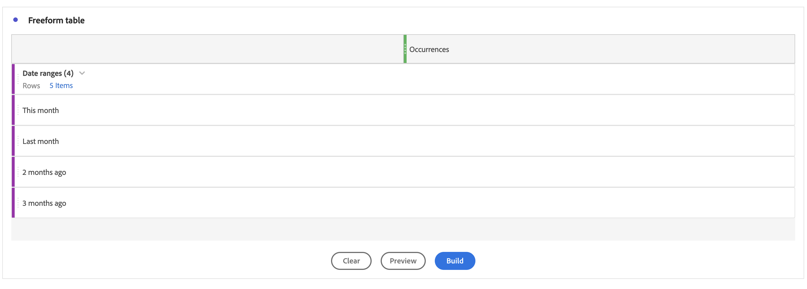

# ワークスペースレポートで日付範囲のDimension順を手動で並べ替える方法

この記事では、Adobe Analytics Customer Journey Analyticsでの日付範囲Dimensionの並べ替えに関する問題について説明します。 この回避策では、「テーブルビルダー」機能を使用してディメンションを手動で並べ替え、「今月」などのカスタム並べ替えを可能にします `>`  &quot;先月&quot; `>`  「2 か月前」 `>`  「3 か月前」。

## 説明 {#description}

<b>0.5511122</b>
Adobe AnalyticsCustomer Journey Analytics

<b>問題</b>
日付範囲のDimensionを「今月」、「先月」、「2 か月前」、「3 か月前」の順に並べ替えたい場合。

ただし、並べ替えアイコンをクリックすると、異なる順序で表示されます。
   Dimension順を手動で並べ替えるにはどうすればよいですか？  
            

## 解決策 {#resolution}

「テーブルビルダー」機能を使用して、Dimensionを手動で並べ替えることができます。

フリーフォームテーブルを開き、「テーブルビルダーを有効にする」ボタンをクリックします。

Dimensionを目的の順序でテーブルにドロップし、「ビルド」ボタンをクリックします

Dimensionは、「今月」、「先月」、「2 か月前」、「3 か月前」の順に並べ替えられました

