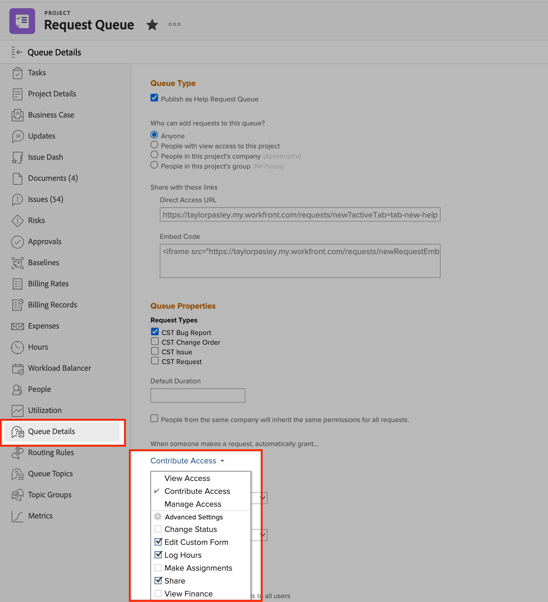

# カスタムフィールドを編集できません | Workfront

## 説明 {#description}

<b>環境</b>
Workfront

<b>問題/症状</b>
ユーザーがカスタムフィールドの編集で問題が発生する場合は、様々なシナリオがあります。 例えば、リクエストの送信時、オブジェクトのカスタムフォームの表示時、またはレポートのカスタムフィールドの表示時などです。

## 解決策 {#resolution}

<b>解決する手順：</b>
1. フィールドを含むフォームが、編集しようとしているオブジェクトに添付されていることを確認します。
   1. 管理者以外のユーザーがフォームをオブジェクトに添付する場合、フォームを添付するには、そのオブジェクトへのアクセスを管理する必要があります。
2. フォーム共有のすべての詳細が正しいことを確認します。
   1. を開きます。 <b>共有</b> フォームを添付するオブジェクトの設定。 以下を参照してください。
   2. の <b>共有</b>メニュー
      - ユーザーがリストに表示されない場合は、 <b>共有</b> メニュー
   3. ユーザーが <b>投稿</b> 許可 <b>カスタムフォームを編集</b> 有効： <b>詳細設定。 </b>以下を参照してください。
   4. <b>（この手順はオプションです） </b>このフォームが<b> リクエストキュー </b>共有設定を<b> リクエストキュー </b>カスタムフォームにも適用されます。 次を参照してください。

詳しくは、次のリンクを開いてください。

- [カスタムフォームフィールドの情報を編集](https://experienceleague.adobe.com/docs/workfront/using/basics/work-with-custom-forms/edit-custom-forms.html?lang=en)
- [リクエストキューの作成](https://experienceleague.adobe.com/docs/workfront/using/manage-work/requests/create-and-manage-request-queues/create-request-queue.html?lang=en)

