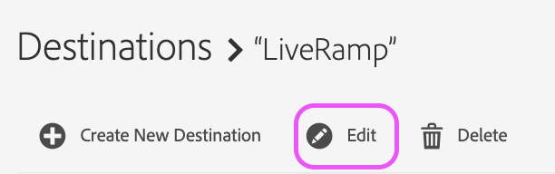

# LiveRamp サーバー間の宛先

この記事では、Audience Manager内の LiveRamp 宛先の概要を説明します。

## 説明 {#description}

<b>環境</b>

Adobe Audience Manager

<b>問題／症状</b>

この記事では、Audience Manager内の LiveRamp 宛先の概要を説明します。

<b>学習目標</b>

- &#x200B;&#x200B;&#x200B;&#x200B;&#x200B;&#x200B; &#x200B;LiveRamp 宛先設定プロセス
- セグメントの有効化プロセス

## 解決策 {#resolution}

<b>LiveRamp 宛先の設定</b>

既存の LiveRamp 宛先がある場合は、セグメントのアクティベーションの節にスキップしてください。 

LiveRamp 宛先はです [サーバー間の統合](https://experienceleague.adobe.com/docs/audience-manager/user-guide/features/destinations/device-based/device-based-destinations-list.html?lang=ja)（設定がバックエンドで行われることを意味します）。 初めて宛先を設定する場合は、Audience Manager カスタマーケアチームの支援が必要です。 からケースを開けてください [Admin Console](https://adminconsole.adobe.com/) liveramp 宛先の作成をリクエストします。 次の重要な詳細を必ず含めてください。

- 宛先名と説明
- LiveRamp クライアント名（LR 担当者が提供する英数字の値）
- セグメントマッピングの環境設定：手動 ID と自動入力 ID

セグメントマッピングオプションは、LiveRamp プラットフォームへの配信方法に影響を与えます。 詳しくは、セグメントのアクティベーションの節を引き続き参照してください。

<b>セグメントの有効化プロセス</b>

カスタマーケアチームが宛先を作成すると、特定のオーディエンス/セグメントを、UI から直接 LiveRamp 宛先に対してアクティブ化できます。 まず、宛先に移動し、「編集」を選択する必要があります。

次に、この画面からマッピングするセグメントを特定して追加します。

マッピング値は、LiveRamp がプラットフォーム内のオーディエンスを表す方法を指示します。 

自動入力（デフォルトのオプション）を使用して宛先を設定する場合、セグメント ID はマッピングフィールドに自動的に入力されます。 つまり、すべてのセグメントが LiveRamp プラットフォーム内の ID 別に整理されます。

セグメントを手動でマッピングする場合は、マッピング値を設定する際に、セグメントに独自のわかりやすい名前または ID を選択できます。 この欠点は、セグメントをマッピングするたびに、これらの値を手動で入力する必要があることです。 これが、デフォルトで推奨される方法には、セグメント ID の自動マッピングが含まれる理由です。 このプロセスに関してご質問がある場合は、Audience Managerカスタマーケアでケースを開いてください。そうすることで、さらにサポートを提供できます。
