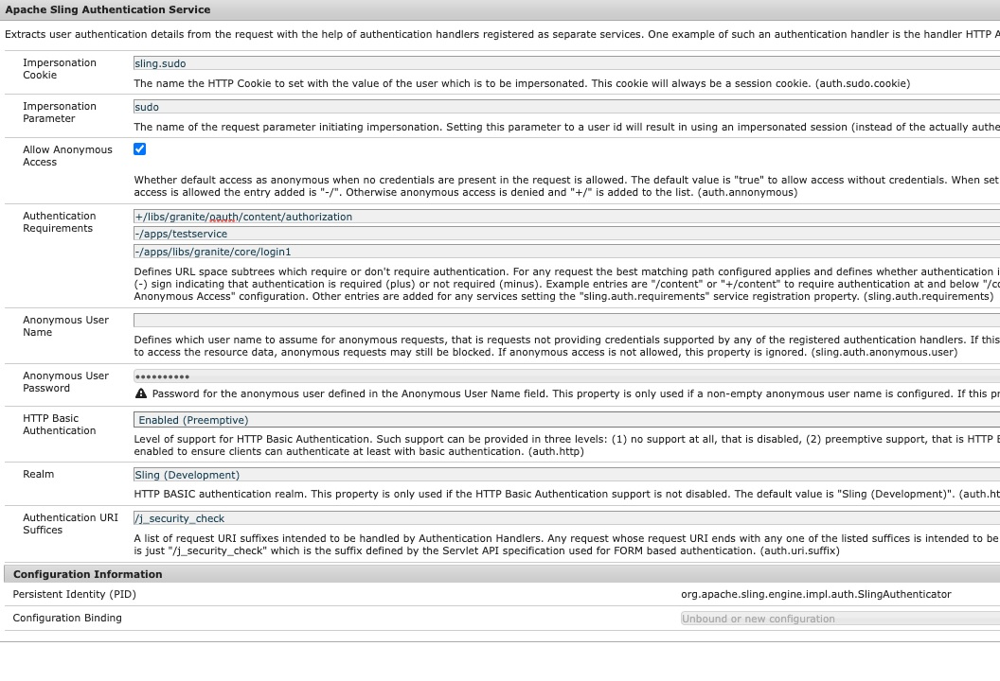

# AEM OAuth フローに失敗した場合にカスタムログインページにリダイレクトする方法

## 説明 {#description}

<b>環境</b>
Experience Manager

<b>問題/症状</b>
AEM Open Authorization(OAuth) フローに失敗した場合に、Adobe Experience Manager(AEM) パブリッシュ環境のカスタムログインページにリダイレクトする方法を教えてください。

## 解決策 {#resolution}

Security Assertion Markup Language(SAML)/OAuth フローの場合、AEM認証フローにエラーがあると、デフォルトの標準 (OOTB)AEMログインページにリダイレクトされます。

したがって、カスタムの SAML/OAuth IDP ログインページにユーザーをリダイレクトする必要があります。 次の手順に従います。

1. このノードパスをコピー */libs/granite/core/content/login* から */apps/granite/core/content/login1* 以下のように。
2. 次のリソースタイプを変更する： */apps/granite/core/content/login1* から <b>testservice</b>、以下に示すように。
3. の作成 `rep:policy` 次を使用した login1 のノード： <b>子を許可</b>、以下に示すように。
4. の作成 <b>testservice</b> フォルダーの下 <b>/apps</b> とを追加します。 <b>sling:resourceType</b> と <b>testservice</b> を作成し、 <b>testservice.jsp</b>、以下に示すように。
5. OSGI 設定を開きます。 <b>AdobeGranite ログインセレクター認証ハンドラー</b> 「デフォルトのログインページ」を「 */apps/granite/core/content/login1* をクリックし、 `auth.loginselector.mappings` プロパティを使用して、保護されたパスのオーバーレイ表示されたログインページを指定します。 次を参照してください。
6. OSGI 設定を開きます。 <b>Apache Sling Authentication Service</b> とを追加します。 *-/apps/granite/core/content/login1* および *-/apps/testservice*&#x200B;から `sling.auth.requirements` リスト。 次を参照してください。

