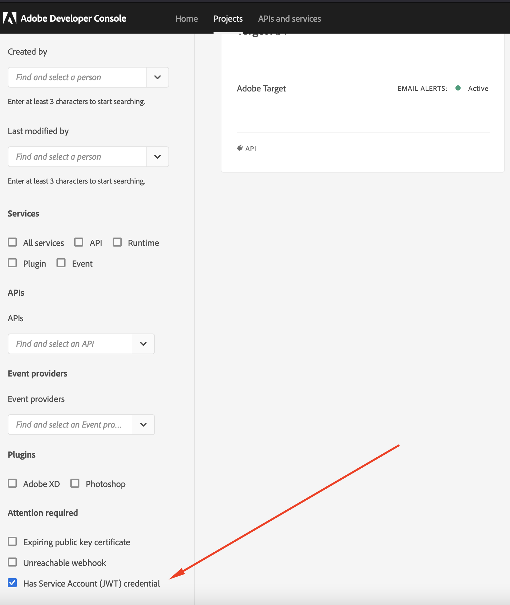

# JWT から OAuth サーバー間で資格情報を移行する手順

サービスアカウントから OAuth サーバー間資格情報に移行して、新しい Oauth サーバー間資格情報を使用する方法を説明します。

## 説明 {#description}

### 環境

- Analytics
- Audience Manager
- ジャーニー分析

### 問題/症状

サービスアカウント（JWT）資格情報は廃止され、新しい OAuth サーバー間資格情報に置き換わりました。 新しい認証情報により、Adobeアプリケーションの開発と管理が容易になります。 また、証明書を定期的にローテーションする必要がなくなり、標準の OAuth2 ライブラリを使用してすぐに機能します。 

<b>注意：実行中のAdobeアプリケーションまたは統合は、2025 年 1 月 1 日（PT）まで中断されません。</b>
        <b></b>       

## 解決策 {#resolution}

1. にログインします [Adobe Developer コンソール](https://developer.adobe.com/console).
2. 左側のフィルタリングメニューから、オプションを選択します <b>サービスアカウント（JWT）資格情報あり</b>l.この方法では、サービスアカウント（JWT）秘密鍵証明書を持つすべてのプロジェクトが表示されます。

   
3. 「」をクリックします <b>新しい資格情報の追加</b> ボタンをクリックして移行を開始します。

   
4. 新しい資格情報 <b>OAuth サーバー間</b> 左側に追加されました。 クリック <b>移行のキャンセル</b> 移行をキャンセルする場合。 「」をクリックします <b>レビューと削除 </b>新しい資格情報かどうかを検証後のボタン <b>OAuth サーバー間</b> は正常に動作しています。 さらに、JWT 資格情報を削除して移行を完了します。

   
5. OAuth2.0 ライブラリを使用してユーザーアプリケーションコードを更新し、新しい資格情報でアクセストークンを生成します。 （以下を参照するか、で他のライブラリを表示） [https://oauth.net/code/](https://oauth.net/code/)）に設定します。

   - [パスポート JS](https://github.com/jaredhanson/passport) （Node.js）
   - [ばねセキュリティ](https://spring.io/projects/spring-security) （Java）
   - [Authlib](https://github.com/lepture/authlib) （Python）
6. 最後のアクセス メニューまたは最後に使用したメニューのタイムスタンプを確認し、新しい資格情報を使用して、ユーザーアプリケーションで生成されたアクセス トークンを検証します。

   
7. 古い認証情報が正常に置き換えられたら、古い認証情報を削除する最後の手順に移動します。

   
8. 移行が完了した時点で、OAuth サーバー間の新しい資格情報のみが左側に残ります。

<b>参照ドキュメント</b>
2025 年 1 月 1 日（PT）以降もアプリケーションが引き続き機能するようにするには、新しい OAuth サーバー間資格情報を使用するようにアプリケーションを移行する必要があります。
移行プロセスはシンプルで、ダウンタイムなしの移行が可能です。 詳しくは、ドキュメントを参照してください。

1. [サービスアカウント（JWT）資格情報からの移行](https://nam04.safelinks.protection.outlook.com/?url=https%3A%2F%2Fpostoffice.adobe.com%2Fpo-server%2Flink%2Fredirect%3Ftarget%3DeyJhbGciOiJIUzUxMiJ9.eyJ0ZW1wbGF0ZSI6ImJsZXRoZXJfbm90aWNlX29hdXRoX3NlcnZlcl90b19zZXJ2ZXIiLCJlbWFpbEFkZHJlc3MiOiJndXd1K3NvbmVAYWRvYmV0ZXN0LmNvbSIsInJlcXVlc3RJZCI6IjM0ZjIyNTMwLThjMzEtNDlkNC1iZjEyLThlZGIyY2E0ODdhOCIsImxpbmsiOiJodHRwczovL3d3dy5hZG9iZS5jb20vZ28vZGV2c19zMnNfbWlncmF0aW9uX2d1aWRlIiwibGFiZWwiOiI5IiwibG9jYWxlIjoiZW5fVVMifQ.Pr8LjAW5wq_tEqCQLs4Y2fwJSTW_Z2FH0CIVInolEKvySfPDiF7vl8Hg4S9ne_V6a74oLfCVzc99EE9K4XUoBQ&amp;amp;data=05%7C01%7Cguwu%40adobe.com%7C3b1b2261ea264d45d9df08db4ce8a7de%7Cfa7b1b5a7b34438794aed2c178decee1%7C0%7C0%7C638188334359675040%7CUnknown%7CTWFpbGZsb3d8eyJWIjoiMC4wLjAwMDAiLCJQIjoiV2luMzIiLCJBTiI6Ik1haWwiLCJXVCI6Mn0%3D%7C3000%7C%7C%7C&amp;amp;sdata=dd8x%2FoDHh0QUi3xboxa78uA54JXEaVq5qYkP8zkvymk%3D&amp;amp;reserved=0)
2. [新しい Oauth サーバー間資格情報の使用](https://nam04.safelinks.protection.outlook.com/?url=https%3A%2F%2Fpostoffice.adobe.com%2Fpo-server%2Flink%2Fredirect%3Ftarget%3DeyJhbGciOiJIUzUxMiJ9.eyJ0ZW1wbGF0ZSI6ImJsZXRoZXJfbm90aWNlX29hdXRoX3NlcnZlcl90b19zZXJ2ZXIiLCJlbWFpbEFkZHJlc3MiOiJndXd1K3NvbmVAYWRvYmV0ZXN0LmNvbSIsInJlcXVlc3RJZCI6IjM0ZjIyNTMwLThjMzEtNDlkNC1iZjEyLThlZGIyY2E0ODdhOCIsImxpbmsiOiJodHRwczovL3d3dy5hZG9iZS5jb20vZ28vZGV2c19zMnNfY3JlZGVudGlhbF9vdmVydmlldyIsImxhYmVsIjoiMTAiLCJsb2NhbGUiOiJlbl9VUyJ9.c-c4--RAgDvS0l-WI5yIuYBIbzL7OeWXepCCfSzR1AkdVnrTZmWmm7jYmu11JqHZ_UBPANJqYEzEZrtydXY0YQ&amp;amp;data=05%7C01%7Cguwu%40adobe.com%7C3b1b2261ea264d45d9df08db4ce8a7de%7Cfa7b1b5a7b34438794aed2c178decee1%7C0%7C0%7C638188334359675040%7CUnknown%7CTWFpbGZsb3d8eyJWIjoiMC4wLjAwMDAiLCJQIjoiV2luMzIiLCJBTiI6Ik1haWwiLCJXVCI6Mn0%3D%7C3000%7C%7C%7C&amp;amp;sdata=YwiTIXMxPv9MhhEhVR3sv0g%2Bqi4NP8OERnJxE9C65I0%3D&amp;amp;reserved=0)
3. [よくある質問（FAQ）](https://nam04.safelinks.protection.outlook.com/?url=https%3A%2F%2Fpostoffice.adobe.com%2Fpo-server%2Flink%2Fredirect%3Ftarget%3DeyJhbGciOiJIUzUxMiJ9.eyJ0ZW1wbGF0ZSI6ImJsZXRoZXJfbm90aWNlX29hdXRoX3NlcnZlcl90b19zZXJ2ZXIiLCJlbWFpbEFkZHJlc3MiOiJndXd1K3NvbmVAYWRvYmV0ZXN0LmNvbSIsInJlcXVlc3RJZCI6IjM0ZjIyNTMwLThjMzEtNDlkNC1iZjEyLThlZGIyY2E0ODdhOCIsImxpbmsiOiJodHRwczovL3d3dy5hZG9iZS5jb20vZ28vZGV2c19zMnNfbWlncmF0aW9uX2d1aWRlX2ZhcSIsImxhYmVsIjoiMTEiLCJsb2NhbGUiOiJlbl9VUyJ9.8IlQUL_WbLKsMUDG4VHvqnwqI0l6TzEXSN0I_R_dXCswvDQpusEgm5LstaLYWzPy0crhk_ShRbmjZvMVS5t1Mg&amp;amp;data=05%7C01%7Cguwu%40adobe.com%7C3b1b2261ea264d45d9df08db4ce8a7de%7Cfa7b1b5a7b34438794aed2c178decee1%7C0%7C0%7C638188334359675040%7CUnknown%7CTWFpbGZsb3d8eyJWIjoiMC4wLjAwMDAiLCJQIjoiV2luMzIiLCJBTiI6Ik1haWwiLCJXVCI6Mn0%3D%7C3000%7C%7C%7C&amp;amp;sdata=n4WBY0gemPujdOZRaTMICsePuQJsuh9STbkgEsvyai8%3D&amp;amp;reserved=0)

ご不明な点については、Adobe担当者またはサポートチームにお問い合わせいただくか、Adobe Developer コンソールをご覧ください [フォーラム](https://nam04.safelinks.protection.outlook.com/?url=https%3A%2F%2Fpostoffice.adobe.com%2Fpo-server%2Flink%2Fredirect%3Ftarget%3DeyJhbGciOiJIUzUxMiJ9.eyJ0ZW1wbGF0ZSI6ImJsZXRoZXJfbm90aWNlX29hdXRoX3NlcnZlcl90b19zZXJ2ZXIiLCJlbWFpbEFkZHJlc3MiOiJndXd1K3NvbmVAYWRvYmV0ZXN0LmNvbSIsInJlcXVlc3RJZCI6IjM0ZjIyNTMwLThjMzEtNDlkNC1iZjEyLThlZGIyY2E0ODdhOCIsImxpbmsiOiJodHRwczovL2V4cGVyaWVuY2VsZWFndWVjb21tdW5pdGllcy5hZG9iZS5jb20vdDUvYWRvYmUtZGV2ZWxvcGVyLWNvbnNvbGUvY3QtcC9hZG9iZS1pby1jb25zb2xlIiwibGFiZWwiOiIxMiIsImxvY2FsZSI6ImVuX1VTIn0.P8FY77-eRzVSjnf09no_Hn5owFmpREoMVLK5OSTU6WWBApUGuQH0fokMAu1R0L-uTQlCovlnIGYD7NRoqMFD8g&amp;amp;data=05%7C01%7Cguwu%40adobe.com%7C3b1b2261ea264d45d9df08db4ce8a7de%7Cfa7b1b5a7b34438794aed2c178decee1%7C0%7C0%7C638188334359675040%7CUnknown%7CTWFpbGZsb3d8eyJWIjoiMC4wLjAwMDAiLCJQIjoiV2luMzIiLCJBTiI6Ik1haWwiLCJXVCI6Mn0%3D%7C3000%7C%7C%7C&amp;amp;sdata=%2FhbICP9PCZsfsNDrBYaGlEb%2FREbBJMjNZeWPzoOPJsk%3D&amp;amp;reserved=0).
