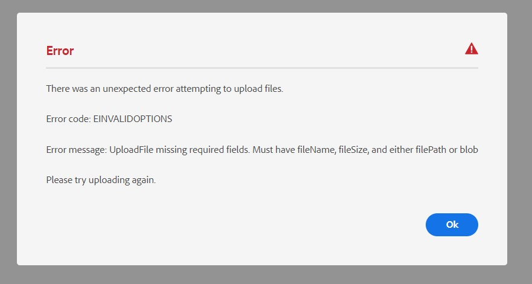

# アセットのアップロードが失敗し、一括コンテンツに関するエラーメッセージが表示される

## 説明 {#description}

<br>説明<br><br>
<b>環境</b>
Experience Manageras a Cloud Service

<b>問題/症状</b>
複数のアセットをフォルダーにアップロードすると、次のエラーがスローされる。




## 解決策 {#resolution}

解決策<br>


このエラーは、次の関数の条件の 1 つとして 0 バイトのアセットをアップロードしようとした場合に発生する可能性があります`[` 0`]`  が満たされなかった。

0 バイトのファイルや、次の関数で詳しく説明されているその他の条件を探します。`[` 0`]`

含まれているフォルダーから 0 バイトアセットを削除すると、残りのアセットが正常にアップロードされます。

ファイルをアップロードする際に必要な条件は次のとおりです。

1. fileName
2. fileSize
3. filePath
4. blob


`[` 0`]`


```none
function ensureRequiredOptions(options) {
                if(!options.fileName || !options.fileSize || (!options.filePath && (!options.blob || !options.blob.slice))) {
                    throw new UploadError('UploadFile missing required fields. Must have fileName, fileSize, and either filePath or blob', ErrorCodes.INVALID_OPTIONS);
                    }
            }
```

