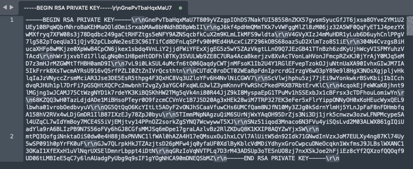

# Workfront Fusion: AEM Assets Fusion の JWT 接続エラー


Fusion AEM Assetsモジュールを使用してAEM Assetsas a Cloud Serviceの接続を設定する際に JWT 接続エラーが発生した場合は、秘密鍵が正しくフォーマットされているかどうかを確認します。

## 説明 {#description}


### 環境

- Adobe Workfront Fusion
- Adobe Experience Manager


### 問題／症状

Fusion AEM Assetsモジュールを使用してAEM Assetsas a Cloud Serviceの接続を設定すると、次のエラーが発生する場合があります。


```
Failed to verify connection 'My AEM Assets as a Cloud Service connection'. Function 'jwt' finished with error! error:1E08010C:DECODER routines::unsupported.
```


これは、通常、秘密鍵が正しく形式設定されていないことが原因です。


## 解決策 {#resolution}


次の手順に従ってエラーを解決します。

1. Adobe Developerコンソールからダウンロードした JSON ファイル内の秘密鍵をコピーし、テキスト編集プログラムで開きます。
2. 秘密鍵には、次のスクリーンショットの例に示すように、複数の復帰文字がリストされます（\r\n など）。     
3. 秘密鍵に表示されるすべてのキャリッジリターン文字（例：\r\n）を削除し、手動リターンに置き換えます。
4. 完了したら、秘密鍵をコピーして、接続を完了するために必要な他の情報と共に、Fusion のAEM Assets設定モジュールに貼り付けます。


### 関連する読み取り

- [Fusion でのAEM Assets接続の設定](https://experienceleague.adobe.com/docs/workfront/using/adobe-workfront-fusion/fusion-apps-and-modules/aem-assets-modules.html?lang=en)
- [サーバー側 API 用のアクセストークンの生成](https://experienceleague.adobe.com/docs/experience-manager-cloud-service/content/implementing/developing/generating-access-tokens-for-server-side-apis.html?lang=ja#the-server-to-server-flow)

