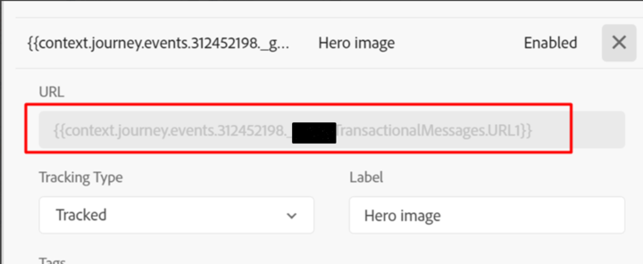

# AJO メールトラッキングデータのクリックボリュームが不正確

この記事では、E メールトラッキングデータの不一致について、考えられる原因の 1 つについて説明します。

## 説明 {#description}

### 環境

Adobe Journey Optimizer

### 問題／症状

AJO の E メールトラッキング統計は、トランザクション E メールジャーニーでのクリック数とユニーク開封数に大きな相違があることを示しています。 このクリック量は非常にありえないようで、精度に関する懸念が生じます。

## 解決策 {#resolution}

これは、 <b>URL</b> フィールドには、有効な URL と見なされない値が含まれています。 次のスクリーンショットは図です。

同様の状況でのクリック数と個別開封数の不一致を回避するには、静的な <b>URL</b> 電子メールの一部として割り当てられ、イベント属性から動的なパーツを提供します。
