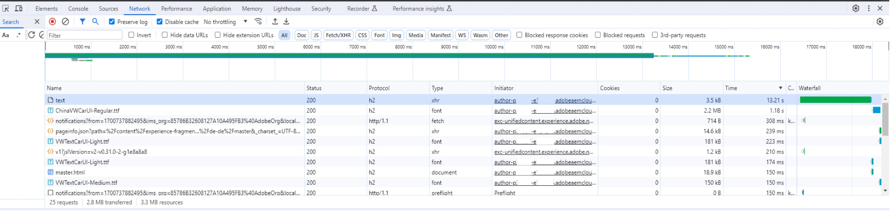

# コンテンツ編集中のパフォーマンスの問題


コンテンツの編集時にパフォーマンスの問題をトラブルシューティングするには、ブラウザー開発者コンソールで、最も時間のかかるリクエストを確認し、リクエスト URL を確認します。 次に、AEM SDK バージョン 2023.9.13665以降と同等のバージョンにアップグレードします。

## 説明 {#description}


### 環境

AEM as a Cloud Service

バージョン：AEM SDK v2023.8.13206以前

### 問題/症状

バージョン 2023.9.13665より前のAEM SDK バージョンがある場合、ページの編集時にパフォーマンスの問題が発生する可能性があります。

例えば、新しい空のエクスペリエンスフラグメントの場合、単一のテキストコンポーネントを追加すると、ページが再び使用可能になるまで最大 15 秒かかることがあります。 ページが応答を停止し、何かが待機し、ある時点で更新します。


## 解決策 {#resolution}


### トラブルシューティング

ブラウザー開発者コンソールで、最も時間のかかるリクエストを確認し、リクエスト URL を確認します。

上記の例の場合：




作成者のエラーログで、リクエスト URL のパス ( 例： `/content/experience-fragments/path/to/experience/fragment/_jcr_content/root/container/text`

### 解決策

ログを確認すると、遅延の理由が次のようになっていることがわかります。 <b>`[` 1`]` </b>. The `ProcessorUtils` は、リポジトリの状態に応じて時間がかかる可能性のある、インデックス内のジョブを待機します。 平均して、最小待機時間は 5 ～ 7 秒で、その後ジョブの実行に要する時間です。

これは、社内の Jiras(SITES-14804および GRANITE-45493) で追跡されている既知の問題です。 しかし、修正が実装され、Oak バージョン 1.54 に含まれていました — <b>`[` 2`]` </b>.

AEM SDK バージョン 2023.9.13665には Oak 1.54 が含まれていました。

したがって、この問題が発生する環境を軽減するために、2023.9.13665以降のバージョンにアップグレードする必要があります。

`[` 1`]`


```
author    aemerror    23.11.2023 11:12:44.432    WARN    [  [ 1700737951330]  POST /content/experience-fragments/path/to/experience/fragment/_jcr_content/root/container/text HTTP/1.1]  com.adobe.cq.updateprocessor.impl.ProcessorUtils Deferred job availability; took 13011ms to become available through index.
```


`[` 2`]`

[Jackrabbit Oak / OAK-10265](https://issues.apache.org/jira/browse/OAK-10265)
