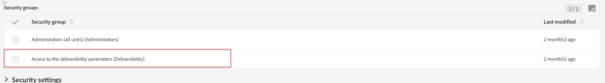

# ACS のブランディング設定を編集できない

この記事では、ACS でブランディング設定を編集できないCampaign Standardの問題の解決策を説明します。 に割り当てられているかどうかを確認する必要があります <b>配信品質パラメーターへのアクセス</b> セキュリティグループ。割り当てられていない場合は割り当てられます。

## 説明 {#description}

### 環境

Adobe Campaign Standard

### 問題/症状

Adobe Campaign Standardのブランディング設定を編集することはできません。

## 解決策 {#resolution}

ブランド設定を編集するには、にアクセスします <b>管理者</b> セキュリティ グループが不十分です

次のパスの下のインスタンスでアクセス権を確認します。 <b>管理 </b>`>`  <b>ユーザー</b> および <b>セキュリティ </b>`>`  <b>ユーザー</b>. セキュリティグループで、に割り当てられていることを確認します <b>配信品質パラメーターへのアクセス</b> セキュリティグループ。

このグループに割り当てられると、ブランド設定を編集できるようになります。
