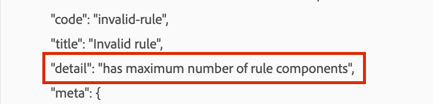

# Experience Platformデータ収集 — ルールにカスタムイベントを追加した際にエラーが発生しました。「ルールコンポーネントの最大数を持つ」

Experience Platformデータ収集プロパティのルールにイベントを追加すると、エラー「ルールコンポーネントの最大数を持つ」が表示される

## 説明 {#description}

*Adobe Experience Platformのタグは、ルールベースのシステムに従います
 Events (If)：イベントは、ルールで検索する対象です。 これは、イベント、該当する条件および例外を選択することで定義されます。*

次のスクリーンショットに示すように、条件（イベント）を既に多数の条件を持つプロパティルールに追加しようとしていますが、変更の保存時にエラーが発生します。

## 解決策 {#resolution}

イベントタグのデータ収集ルールに追加できるイベント/条件は、最大で 100 個までに制限されています。Adobeタグ。

しかし、一般的なコンセンサスは、このような大量のルール条件を持つことは非常に珍しく、現在の制限が引き上げられる可能性は低いということです。 これが本当に必要なものである場合は、カスタムコードとケース文を使用することをお勧めします。
